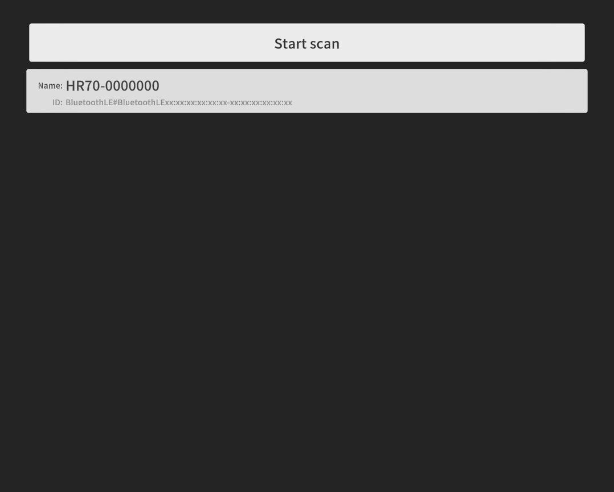
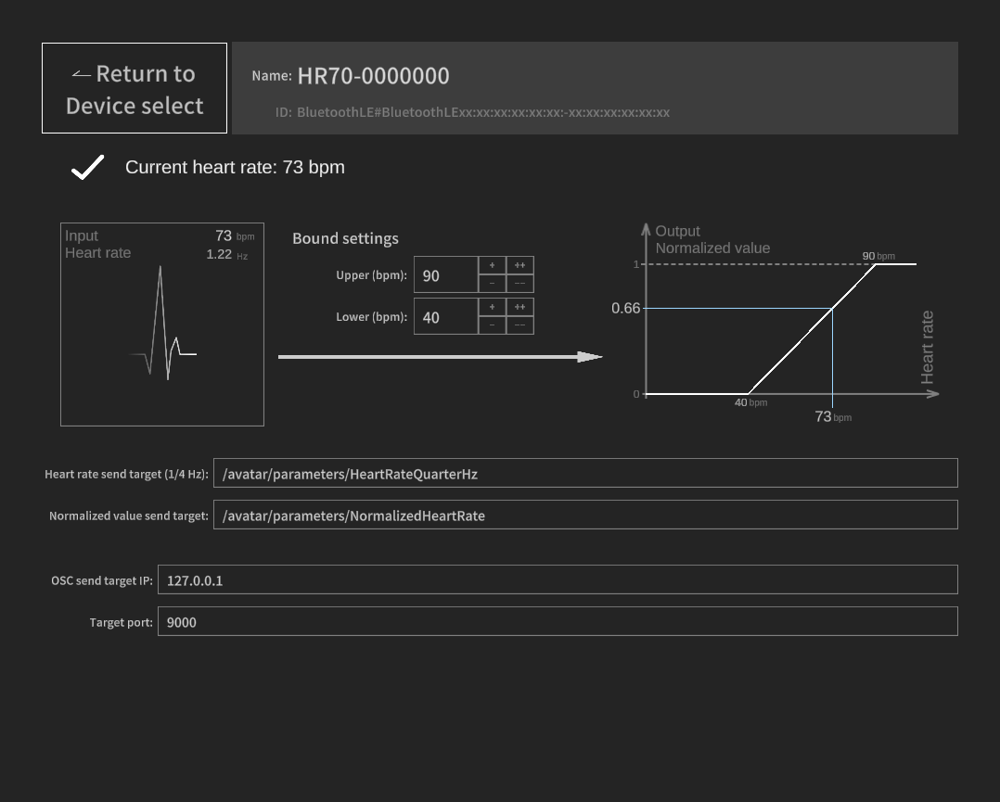

# BleHeartRate-OscSender
Read Heart rate value from BLE device.
A tool sends heart‑rate data from a BLE device to an OSC server.

## Overview
This application reads heart‑rate data from a BLE device and sends the data to an OSC server (e.g. VRChat).
The BLE device must implement the **Heart Rate Service** (e.g. COOSPO HW807/HW9, IGPSPORT HR70, etc.).

After selecting a BLE heart-rate monitor device, the app retrieves the heart-rate data and sends the following values via OSC:
* One-quarter of the beats-per-minute value (intended for use in VRChat, where various parameter limitations make it more practical to send a reduced value)
* A normalized value (0–1) calculated from the specified minimum and maximum heart rates

With this, you can achieve effects such as (in VRChat, for example):
* Flashing accessories in sync with your heart rate
* Changing accessory colors depending on heart-rate increases or decreases

## How to use
* Start scanning for BLE devices and select your heart-rate monitor from the list.

The app will automatically search for and connect to the heart-rate service.
* Adjust the OSC parameter name and target IP/port as needed.

When the application starts, it automatically reconnects to the BLE device that was connected during the previous session.

# Credits / Third-Party Assets
This project uses the following third-party libraries and assets:

## uOSC
- Repository: https://github.com/hecomi/uOSC  
- Author: hecomi  
- License: MIT License  
- This package is referenced via Unity's Package Manager.  
  A local copy of the license is not included; please refer to the license at the repository above.

## Noto Sans JP
- Homepage: https://fonts.google.com/noto  
- Author: Google / Adobe  
- License: SIL Open Font License 1.1 (OFL)  
- A copy of the OFL license is included as `OFL.txt` in this project.

## BleWinrtDll (Forked Version)
- Original Repository: https://github.com/adabru/BleWinrtDll  
- Forked Repository: https://github.com/shun1053/BleWinrtDll  
- Author (Original): adabru  
- License: MIT License  
- This project uses a custom-built DLL compiled from my forked version of the library.  
  Modifications (if any) are documented in the forked repository.  
- The original license terms apply; a copy of the MIT License is available in the original repository.
